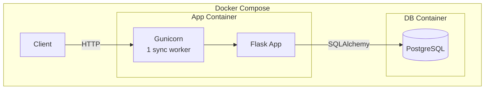
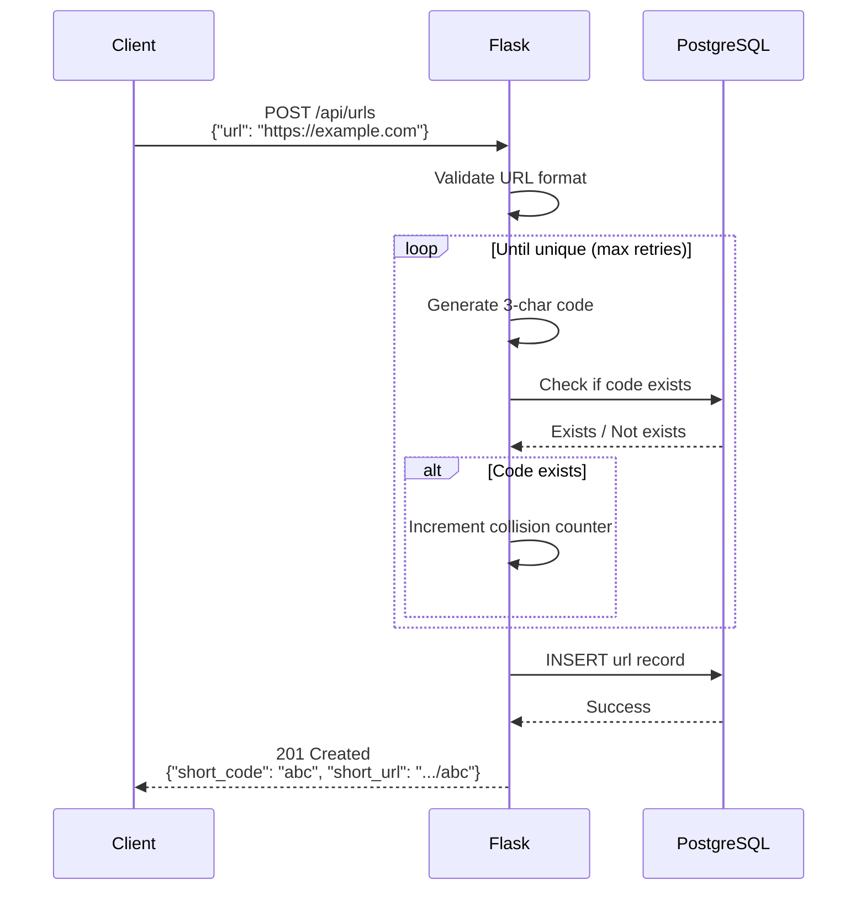
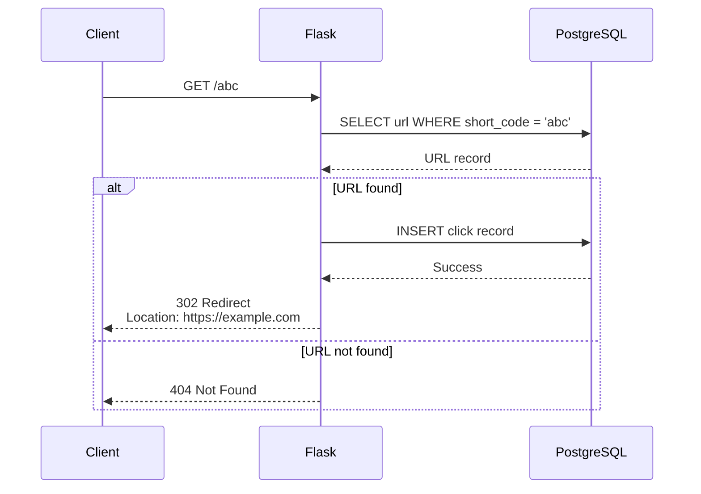
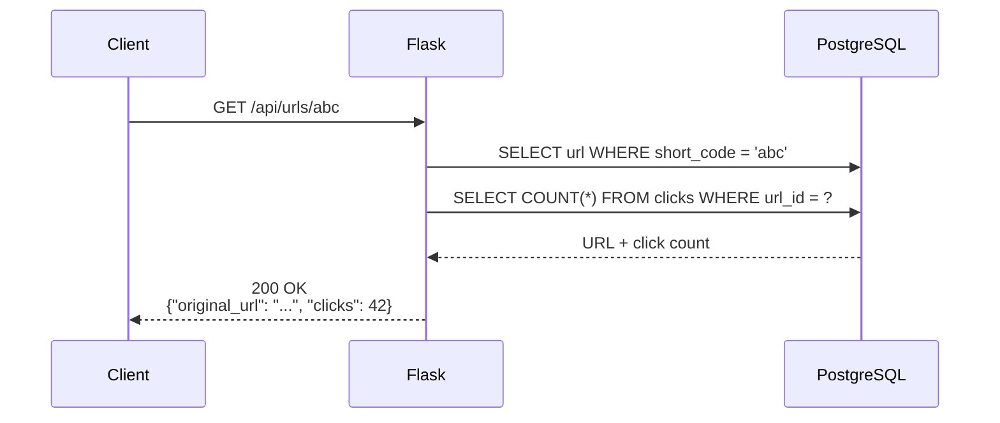
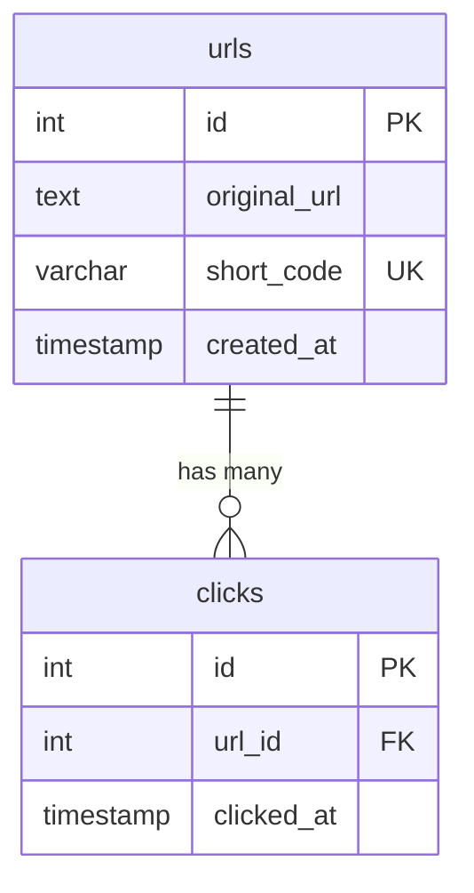

# Architecture Overview

## Version 0.1 — System Components

```mermaid
graph TB
    subgraph Docker Compose
        Client[Client]
        subgraph App Container
            Gunicorn[Gunicorn<br/>1 sync worker]
            Flask[Flask App]
        end
        subgraph DB Container
            PostgreSQL[(PostgreSQL)]
        end
    end
    
    Client -->|HTTP| Gunicorn
    Gunicorn --> Flask
    Flask -->|SQLAlchemy| PostgreSQL
```

## Request Flows

### Create Short URL

```mermaid
sequenceDiagram
    participant C as Client
    participant F as Flask
    participant DB as PostgreSQL
    
    C->>F: POST /api/urls<br/>{"url": "https://example.com"}
    F->>F: Validate URL format
    
    loop Until unique (max retries)
        F->>F: Generate 3-char code
        F->>DB: Check if code exists
        DB-->>F: Exists / Not exists
        alt Code exists
            F->>F: Increment collision counter
        end
    end
    
    F->>DB: INSERT url record
    DB-->>F: Success
    F-->>C: 201 Created<br/>{"short_code": "abc", "short_url": ".../abc"}
```

### Redirect Flow

```mermaid
sequenceDiagram
    participant C as Client
    participant F as Flask
    participant DB as PostgreSQL
    
    C->>F: GET /abc
    F->>DB: SELECT url WHERE short_code = 'abc'
    DB-->>F: URL record
    
    alt URL found
        F->>DB: INSERT click record
        DB-->>F: Success
        F-->>C: 302 Redirect<br/>Location: https://example.com
    else URL not found
        F-->>C: 404 Not Found
    end
```

### Get URL Details

```mermaid
sequenceDiagram
    participant C as Client
    participant F as Flask
    participant DB as PostgreSQL
    
    C->>F: GET /api/urls/abc
    F->>DB: SELECT url WHERE short_code = 'abc'
    F->>DB: SELECT COUNT(*) FROM clicks WHERE url_id = ?
    DB-->>F: URL + click count
    F-->>C: 200 OK<br/>{"original_url": "...", "clicks": 42}
```

## Database Schema

```mermaid
erDiagram
    urls {
        int id PK
        text original_url
        varchar short_code UK
        timestamp created_at
    }
    
    clicks {
        int id PK
        int url_id FK
        timestamp clicked_at
    }
    
    urls ||--o{ clicks : "has many"
```
